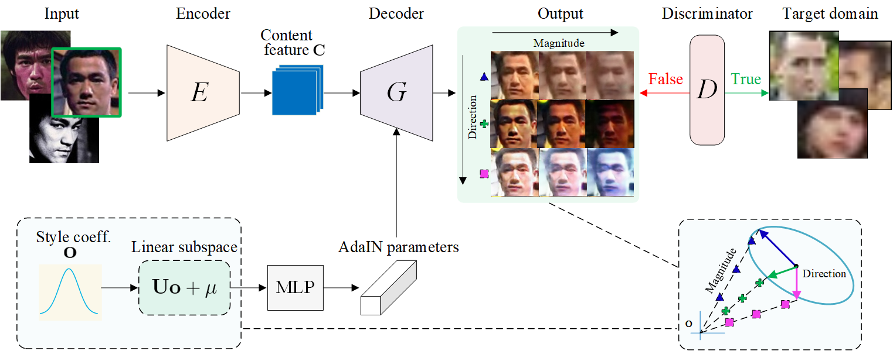
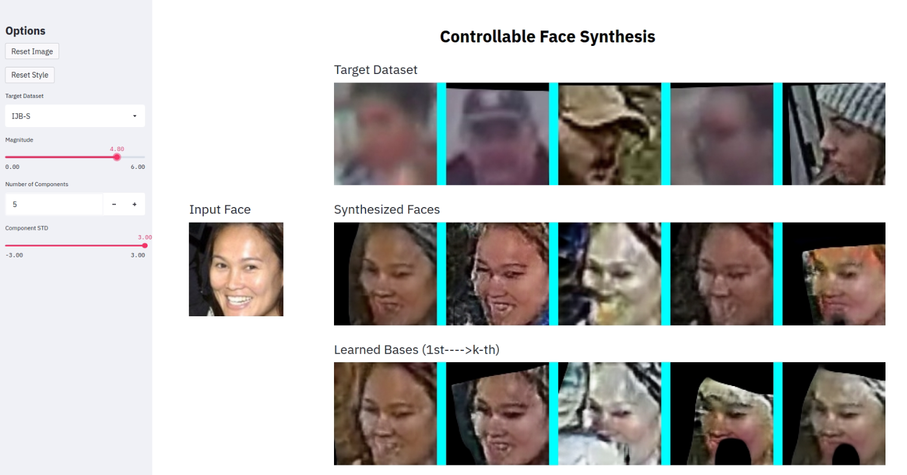

# Controllable Face Synthesis Model (CFSM)

<center></center>

Given an input face image, our CFSM enables precise control of the direction and magnitude of the targeted styles in the generated images. The latent style has both the direction and the magnitude, where the direction linearly combines the learned bases to control the type of style, while the magnitude controls the degree of style. 

## Model Zoo

To visualize for the face synthesis model, we provide trained models which are respectively trained with 6 popular datasets: LFW, AgeDB-30, CFP-FP, IJB-B, WiderFace (WF) and IJB-S. 

| Target Datasets | Weights                                                      |
| --------------- | ------------------------------------------------------------ |
| LFW             | [gdrive](https://drive.google.com/file/d/1uSgdAX_C8bAno2y9V5gwa8ITRtQxmVE1/view?usp=sharing), [baidudrive]() |
| AgeDB-30        | [gdrive](https://drive.google.com/file/d/1074cg1kV5uku2DoQdZONyoehT4R1reaf/view?usp=sharing), [baidudrive]() |
| CFP-FP          | [gdrive](https://drive.google.com/file/d/19GOGU2FkOFY7QsgbpyoC0wYTApXEdGzJ/view?usp=sharing), [baidudrive]() |
| IJB-B           | [gdrive](https://drive.google.com/file/d/1TSxUxNkdI4paFESHwnIxE6DfNWF0XqCg/view?usp=sharing), [baidudrive]() |
| WiderFace (WF)  | [gdrive](https://drive.google.com/file/d/163cBsS3n7gI-2iIWFu2rlaPPmDtMYGH4/view?usp=sharing), [baidudrive]() |
| IJB-S           | [gdrive](https://drive.google.com/file/d/1jFTnZcguO-HYeFXfFyn9-qOLY3sgCxhs/view?usp=sharing), [baidudrive]() |

## Demo

<center></center>

We provide an interface for interactive synthesis based on [StreamLit](https://www.streamlit.io/) (inspired from [here](https://github.com/genforce/sefa)). This interface can be launched with

```
pip install streamlit
streamlit run interface.py
```

## Training

* Please download the released ArcFace model [here](https://drive.google.com/file/d/1GZjPokFv5zXIxol3eZnuByJ0iwDv8inQ/view?usp=sharing) and place it in "/id_weights".
* Prepare the source and target data, and place in "/data".
* Train the model:

```bash
python train.py \
--source_img_path /dataset/v2_39m_source \
--source_list data_list/source_list.txt \
--target_img_path /dataset/widerface \
--target_list data_list/target_list_wf_12k.txt \
--batch_size 32 \
--model_name WiderFace12K \
--n_epochs 5  \
--lambda_identity 8.0   

python train.py \
--source_img_path /dataset/v2_39m_source \
--source_list data_list/source_list.txt \
--target_img_path /dataset/widerface \
--target_list data_list/target_list_wf_12k.txt \
--batch_size 32 \
--model_name WiderFace12K \
--n_epochs 8  \
--epoch 4 \
--lambda_identity 5.0   

python train.py \
--source_img_path /dataset/v2_39m_source \
--source_list data_list/source_list.txt \
--target_img_path /dataset/widerface \
--target_list data_list/target_list_wf_12k.txt \
--batch_size 32 \
--model_name WiderFace12K \
--n_epochs 20  \
--epoch 7 \
--lambda_identity 2.0   
```
